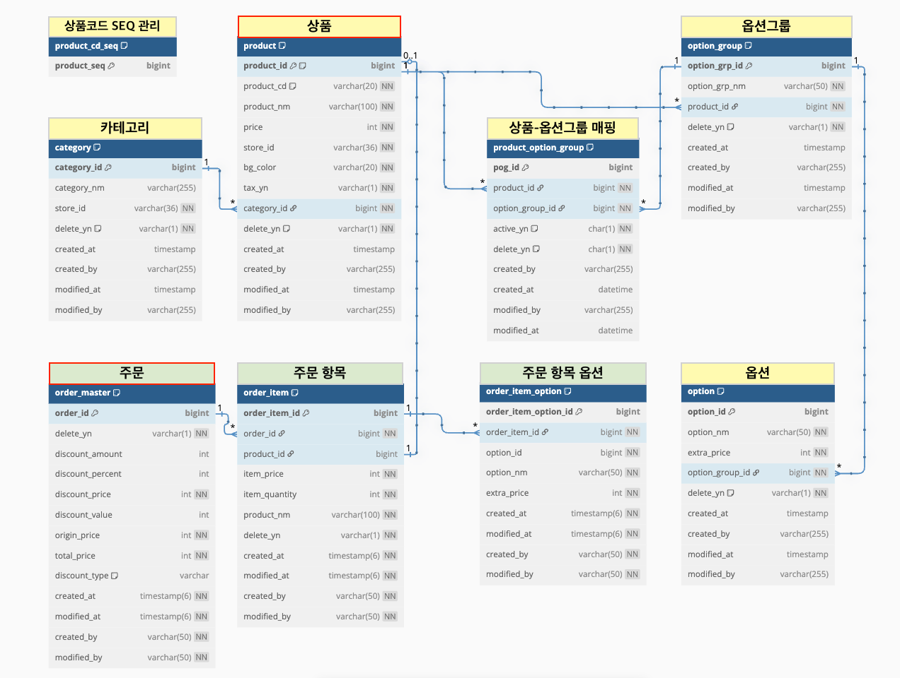

# POS Applicatioan - JPA sandbox
pos application용 엔티티, api 설계

## 1. 기술 스택 (Tech Stack)
* Language: Java 17
* Framework: Spring Boot 3.4
* Database: H2
* ORM: Spring Data JPA + Hibernate
* Build Tool: Gradle

## 2. 테이블 설계 & 고려사항

- **CATEGORY**: 상품 카테고리 정보를 저장
- **PRODUCT**: 상품의 기본 정보를 저장 (`product_cd`는 고유한 상품 코드를 나타냄)
- **PRODUCT_CD_SEQ**: 상품 고유 코드 시퀀스 (`product_cd`) 생성을 위한 시퀀스 값을 관리 시퀀스 자동 증가가 아닌 수동 관리 및 락을 통해 롤백 시에도 ID가 건너뛰는 현상을 방지했음
- **OPTION_GROUP**: 상품에 대한 옵션 그룹 (예: 사이즈, 온도) 정보를 저장
- **OPTION**: 각 옵션 그룹에 속하는 개별 옵션 항목 (예: Tall, Grande, HOT, ICED) 정보를 저장
- **PRODUCT_OPTION_GROUP**: 상품과 옵션 그룹 간의 다대다 관계를 매핑하는 테이블
- **ORDER_MASTER**: 개별 주문의 마스터 정보를 저장 총 금액, 할인 정보 등이 포함
- **ORDER_ITEM**: 주문에 포함된 각 상품 항목 정보를 저장 주문 당시의 상품 정보(이름, 단가, 수량)가 저장
- **ORDER_ITEM_OPTION**: 주문 항목에 대해 선택된 옵션 정보를 저장

💡고려사항
- Safe Delete (논리적 삭제) : 데이터 삭제 시 실제 데이터를 제거하는 대신 delete_yn 필드 값을 'Y'로 변경하여 논리적으로 삭제 처리하도록 하였음
- JpaAuditing : Spring Data JPA Auditing 기능을 활용하여 데이터 생성자/수정자(createdBy/modifiedBy), 생성일시/수정일시(createdAt/modifiedAt)를 자동으로 기록하도록 하였음

## 3. API Endpoints
* 주요 API 엔드포인트는 다음과 같음
* 🔖 Postman 컬렉션 :  [상품&주문관리 API.postman_collection.json](src/main/resources/api_collection_product_order.json)

### 3.1. 카테고리 (Category) 관리

| HTTP Method | Endpoint                     | 설명                     |
| :---------- | :--------------------------- |:-----------------------|
| `POST`      | `/pos/category/v1/categories`| 신규 카테고리 등록             |
| `GET`       | `/pos/category/v1/categories/{categoryId}` | 카테고리 상세 조회 (카테고리ID 기준) |
| `GET`       | `/pos/category/v1/categories`| 카테고리 목록 조회 (카테고리명 검색)  |
| `PUT`       | `/pos/category/v1/categories/{categoryId}` | 카테고리 수정               |
| `DELETE`    | `/pos/category/v1/categories/{categoryId}` | 카테고리 삭제 (Safe Delete)  |

### 3.2. 상품 (Product) 관리

| HTTP Method | Endpoint                     | 설명                       |
| :---------- | :--------------------------- |:-------------------------|
| `POST`      | `/pos/product/v1/products`   | 신규 상품 등록 (옵션 그룹 및 옵션 포함) |
| `GET`       | `/pos/product/v1/products/{productCd}` | 상품 상세 조회 (상품고유ID 기준)     |
| `GET`       | `/pos/product/v1/products`   | 상품 목록 조회 (상품명 검색)        |
| `PUT`       | `/pos/product/v1/products/{productCd}` | 상품 정보 수정                 |
| `DELETE`    | `/pos/product/v1/products/{productCd}` | 상품 삭제 (Safe Delete)      |

### 3.3. 주문 (Order) 관리

| HTTP Method | Endpoint                     | 설명                       |
| :---------- | :--------------------------- |:-------------------------|
| `POST`      | `/pos/order/v1/orders`       | 신규 주문 등록 (주문 항목 및 옵션 포함) |
| `GET`       | `/pos/order/v1/orders`       | 주문 목록 조회 (조건부 조회)        |
| `GET`       | `/pos/order/v1/orders/{orderId}` | 주문 단건 상세 조회 (ID 기준)      |
| `PATCH`     | `/pos/order/v1/orders/item/{orderItemId}` | 주문 항목 수정 - 수량 변경         |
| `DELETE`    | `/pos/order/v1/orders/item/{orderItemId}` | 주문 항목 삭제                 |
| `DELETE`    | `/pos/order/v1/orders/{orderId}` | 주문 삭제                    |

